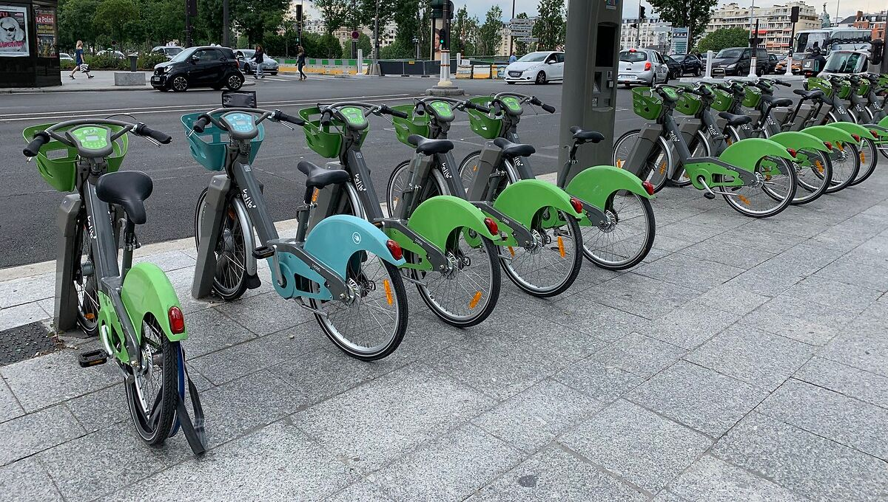
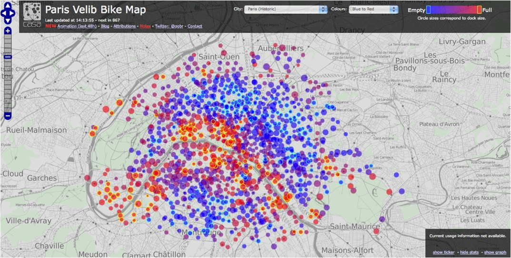

# LEAD / Lime Project

This a little part of a Data Architecture student project, during the Jedha Lead Formation (Data Engineering / MLOps...)

Collective project in 3 days with 3 collaborators : [Marie Agrapart](https://github.com/marieagrapart), [Pascal Toutain](https://github.com/pascalt) and [David Gauthier](https://github.com/DavidTGAUTIER)

We were a team of data engineers at Lime. We had to use the open data from the City of Paris API regarding the coordinates of velib stations and the availability of bikes.

The goal was to tell Lime employees where they could place Lime electric scooters, on a map, by analyzing "real time" public bike availability deficits. 

We had to set up a proof of concept for a data pipeline with technologies like Kafka, Airflow, Streamlit...

The [schematics](./docs/) are visible in the docs folder. [Slide Presentation](./docs/Lime%20-%20Lead%20project%20.pptx) too.

Here, ou principal architecture :
.png)

DESCRIPTION
------

The producer.py script requests the open data API every minutes and sends about 1453 informations of bike availability (1 per station) with a Kafka Confluent Connector to a Postgres database (AWS RDS) wich store its, by overwriting the old information (we think of the planet!).

Another parralelize query, every 24 hours, with a Airflow trigger, allows us to retrieve the GPS coordinates of the velib stations.

The join is made directly in the Streamlit application for the users.

Time lag was to 1-2 seconds, between the send (of the producer script) and our Streamlit app !...

A third query, every hour, is automated with Airflow to take the availability of the bikes with Airflow and, this time, not delete them. The information was sent to an AWS S3 for future analysis, or Machine Learning modeling...

First, we did a proof of concept of this Data Pipeline locally...

Then, we tried to imagine a more complex architecture with two Machine Learning models: a Deep Learning RNN (for time series problems) to predict the availability of bikes in the map, and a Reinforcement Learning model to reduce the travel time of small "refill" trucks in the city.

